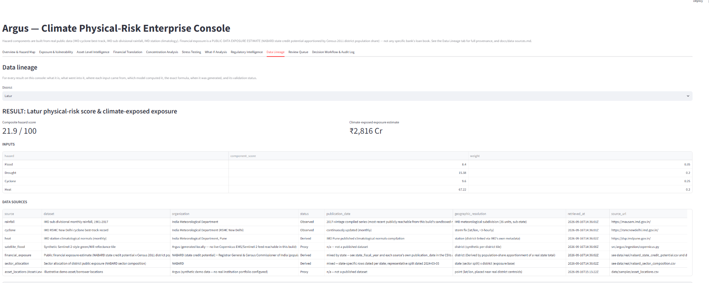
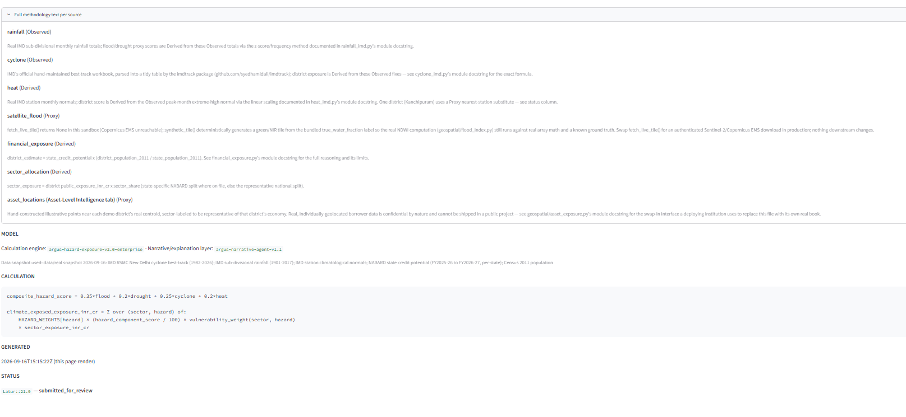

# Argus — Climate Physical-Risk Enterprise Console for Credit Portfolios

> An auditable AI copilot that helps banks and NBFCs answer: where is a portfolio
> financially vulnerable to physical climate risk, how large could the impact be
> under different scenarios, why is it happening, and what should risk teams do —
> built end-to-end on real public data, running on a CPU-only laptop, at zero
> marginal cost.

**Status: working build, not a scaffold.** Every module described below is
implemented and exercised by a real, currently-passing test suite — **111 passed,
1 skipped, 83% coverage** (the skip only runs with a live `ANTHROPIC_API_KEY`;
figures reconfirmed directly against `docs/evaluation-report.md`). Reproduce with
`pytest -q --cov=argus --cov-report=term-missing`. This is a demo-scale build (8
districts, illustrative asset/borrower data, a 3-document regulatory corpus) — see
**Section 9, Limitations**, before treating any figure as production-ready.

## 1. The problem

RBI's [Draft Disclosure Framework on Climate-related Financial Risks (2024)](https://www.rbi.org.in/Scripts/bs_viewcontent.aspx?Id=4393)
and the Basel Committee's [voluntary climate-risk disclosure framework](https://www.bis.org/bcbs/publ/d597.htm)
push regulated lenders toward disclosing physical climate risk by geography and
sector. Today that work is either an expensive third-party subscription or an
unauditable spreadsheet exercise — neither scales to district-level granularity,
explains *why* a figure is what it is, or tells a risk team what to actually do
about it.

Argus turns real public meteorological, financial, and regulatory data into a full
**Hazard × Exposure × Vulnerability = Physical Climate Impact** chain — composite
hazard scores, a public-data financial exposure layer, sector-aware physical
impact, four climate stress-test scenarios, concentration analysis, an interactive
what-if console, and a citation-checked regulatory-intelligence RAG layer — and
routes every AI-drafted disclosure paragraph through an explicit, auditable human
decision workflow before it is ever published. The architecture accepts a real
institution's confidential portfolio as a drop-in replacement for the public-data
estimate without any downstream module changing.

## 2. Quickstart (Windows / PowerShell)

```powershell
git clone <this-repo>
cd argus-climate-risk
python -m venv .venv
.venv\Scripts\Activate.ps1
pip install -e ".[dev]"
python -m argus.agents.orchestrator
```

Representative output (district names, scores and the run ID will differ on each
real run — nothing here is hardcoded):

```
[HIGH RISK] Kanchipuram     item_id=Kanchipuram::38.5  backend=template
[HIGH RISK] Cuttack         item_id=Cuttack::46.1  backend=template
[ok       ] Kozhikode       item_id=Kozhikode::18.7  backend=template
[ok       ] Puri            item_id=Puri::37.3  backend=template
...
Run ID: run-5e966a667ec4
Pending human review (this run): ['Kanchipuram::38.5', 'Cuttack::46.1', ...]
```

Every one of those numbers is computed live from real IMD/NABARD/Census data — edit
a hazard weight in `common/config.py` and re-run to see it change. Each run gets its
own `run_id`; run the orchestrator twice and the pending-review queue still only
ever shows the latest run's items, never a duplicate-looking mix of both.

Then open the full console:

```powershell
streamlit run app/streamlit_app.py
```

11 tabs: Overview & Hazard Map, Exposure & Vulnerability, Asset-Level Intelligence,
Financial Translation, Concentration Analysis, Stress Testing, What-If Analysis,
Regulatory Intelligence, Data Lineage, Review Queue, Decision Workflow & Audit Log.

*macOS / Linux: replace `.venv\Scripts\Activate.ps1` with `source .venv/bin/activate`
and `$env:VAR = "value"` (used later in this document) with `export VAR=value`.
Every other command is identical across platforms.*

## 3. Architecture — what's actually wired up


*How Argus keeps every published figure auditable: the LLM only ever explains
numbers a deterministic Python engine already computed, and a human reviewer —
not the model — is the only thing that can move an item to "published."*

**Deterministic engine vs LLM.** Every score, exposure figure, physical-impact
number, stress-test result, and concentration statistic is produced by plain,
auditable Python; the LLM only ever explains an already-computed result or answers
a retrieval-grounded regulatory question. This is enforced by
`tests/architecture/test_llm_boundary.py`, not just documented — it statically
scans every deterministic-engine module (`geospatial/`, `financial/`,
`analytics/`, `ingestion/`, `explainability/`) for a forbidden LLM import, and
behaviourally proves that a deliberately "hallucinating" fake LLM backend, and a
citation-spoofing one, are both rejected by a `GroundingError` (raised from
`narrative_agent.py`'s `_verify_numeric_consistency` and `_verify_citation`)
before their output ever reaches a reviewer.

**Regulatory RAG — two distinct safeguards, not one.** The Regulatory RAG Agent
(`agents/rag_agent.py`) never asserts what a regulation says without a citation,
enforced by two separate mechanisms: (1) if nothing in the indexed corpus clears
the retriever's minimum relevance score, the agent returns `grounded=False` and an
explicit "route to a human compliance reviewer" message — a hard abstention; (2)
if a match *is* found but its confidence score falls below
`HUMAN_REVIEW_CONFIDENCE_FLOOR` (0.30), the agent still returns the citation but
sets `requires_human_review=True` — a soft flag, not a refusal. Neither path lets
the LLM invent a citation or present a low-confidence match as settled fact.

**Human review, five states, not four.** Every AI-drafted item moves through
`generated → evidence_validated → submitted_for_review → approved / rejected →
published`, with every transition written as its own row in a run-scoped SQLite
audit log (`common/audit.py`). `rejected` is a real, distinct outcome, not a
subset of "review" — a rejected or edited item loops back rather than being
silently dropped, and nothing in the codebase auto-publishes; `approved` is the
only path to `published`.

All of the above is also exposed as MCP tools (`mcp_server/server.py`) — per that
module's own docstring, "calling directly into the same modules the Streamlit
console and the orchestrator use (no duplicated logic)," callable from Claude
Desktop or Claude Code over stdio with no separate API layer to maintain.

Full write-up, including every deliberate simplification and its documented
upgrade path (TF-IDF → sentence-transformers, hand-rolled orchestrator →
LangGraph, etc.): `docs/architecture.md`.

## 4. Real data sources (all free, all public)

| Source | Provides | This build's status |
|---|---|---|
| IMD RSMC New Delhi cyclone best-track (via the `imdtrack` PyPI package) | Real cyclonic-storm observations, 1982–2026 | **Observed**, live-refreshed, with a frozen offline fallback |
| IMD sub-divisional rainfall (1901–2017) | Real monthly/seasonal rainfall, 36 subdivisions — flood & drought proxies derived from it | **Observed** |
| IMD station climatological normals | Real per-station monthly extreme-heat statistics | **Derived** from Observed station normals (one demo district, Kanchipuram, uses the nearest station as a substitute and is explicitly labeled Proxy) |
| NABARD State Credit Seminar priority-sector credit potential | Real, individually-dated state-level figures — **the public-data exposure layer**, apportioned to district level by real Census 2011 population share | **Derived**, explicitly distinguished from any institution's actual portfolio |
| Census of India 2011 | Real state/district population | **Observed** |
| RBI / BIS / NGFS regulatory corpus | RAG grounding corpus | **Derived** — 3 source documents, paraphrased into a labeled corpus, each tagged with its real regulator, publication date, and source URL |
| Satellite NDWI flood-extent tile | Weighted term inside the flood hazard component | **Proxy** — this build's sandboxed network cannot reach a live Copernicus/Sentinel-2 feed; synthetic tile generated deterministically from a known ground-truth water fraction, with a documented swap-in point for a live feed |
| Asset/borrower-level locations (Asset-Level Intelligence tab) | Illustrative demo points near real district centroids | **Proxy** — real individually-geolocated borrower data is confidential and cannot ship in a public project; a swap-in interface is provided for a deploying institution's own book |

**Every dataset carries a full `DataProvenance` record** (dataset, organization,
source URL, publication date, geographic resolution, status, and retrieval
timestamp). The status field's schema (`common/provenance.py`) defines four values
— Observed, Derived, Modelled, Proxy — but this build's actual sources use three
of them (Observed / Derived / Proxy); `Modelled` is reserved for a future
named-model or scenario-framework output and is not currently assigned to any
dataset. See the Data Lineage tab and `docs/data-sources.md` for the complete
table.

## 5. Technology stack (what's installed and tested, not aspirational)

Python (`pyproject.toml` requires `>=3.11`; `mypy` is configured against 3.11) ·
pandas / numpy · **scikit-learn TF-IDF** (RAG retrieval, default) · Pandera (data
quality) · **SQLite** (run-scoped audit log) · Streamlit + Plotly (11-tab console)
· `mcp` SDK / FastMCP, pinned `>=1.6,<2` (tool server) · Anthropic SDK (optional
Claude backend) · `imdtrack` (real IMD cyclone data) · pytest + pytest-cov (test
suite) · ruff + mypy (lint / type-check) · pip-audit (dependency scan) · GitHub
Actions (CI).

Deliberately **not** installed by default: GeoPandas/Rasterio/Shapely (GDAL
toolchain), sentence-transformers/ChromaDB, LangGraph, torch/diffusers — each has
a documented, drop-in upgrade path via a `pyproject.toml` extra (`gis`,
`semantic-rag`, `orchestration`, `augmentation`). See `docs/architecture.md`'s
"Deliberate simplifications" table.

## 6. Running everything (PowerShell)

```powershell
pip install -e ".[dev]"

# inspect any stage in isolation
python -m argus.geospatial.hazard_scoring
python -m argus.financial.impact_engine
python -m argus.financial.stress_testing
python -m argus.financial.translation
python -m argus.analytics.concentration
python -m argus.geospatial.asset_exposure
python -m argus.rag.eval

# run the full pipeline (drafts + queues every district for review under one run_id)
python -m argus.agents.orchestrator

# the console — hazard map, exposure & vulnerability, asset-level intelligence,
# financial translation, concentration, stress testing, what-if, regulatory
# intelligence, data lineage, review queue, decision workflow & audit log
streamlit run app/streamlit_app.py

# the MCP tool server
python -m argus.mcp_server.server

# quality gates (mirrors CI)
ruff check .
mypy src/argus
pip-audit
pytest -q --cov=argus --cov-report=term-missing
```

A local LLM is optional — the pipeline runs fully offline with the deterministic
`template` backend by default. To use a real model:

```powershell
ollama pull qwen2.5:3b-instruct   # ~2GB, CPU-friendly
$env:ARGUS_LLM_MODE = "ollama"
```

## 7. Repository layout

```
argus-climate-risk/
├── README.md
├── docs/                      # architecture.md, data-sources.md, evaluation-report.md,
│                               # runbook.md, adr/, argus-architecture-diagram.png
├── data/
│   ├── real/                  # real IMD/NABARD/Census snapshots (cited, dated)
│   ├── samples/                # district registry + illustrative asset locations (labeled)
│   ├── regulatory_corpus/     # RBI/BIS/NGFS corpus (3 docs, paraphrased, source-labeled)
│   ├── gold/                  # RAG eval gold set + adversarial set
│   └── processed/             # audit_log.db (git-ignored; created at runtime)
├── src/argus/
│   ├── common/                # config, provenance, Pandera schemas, pluggable LLM client, run-scoped audit log
│   ├── ingestion/              # cyclone_imd.py  rainfall_imd.py  heat_imd.py  financial_exposure.py  rbi.py  copernicus.py
│   ├── geospatial/             # flood_index.py (NDWI)  hazard_scoring.py  exposure_engine.py  asset_exposure.py
│   ├── financial/              # sector_allocation.py  vulnerability.py  impact_engine.py  stress_testing.py  translation.py
│   ├── analytics/              # concentration.py
│   ├── rag/                    # chunking.py  retriever.py (TF-IDF)  embeddings.py (semantic, optional)  eval.py
│   ├── agents/                 # data_agent / scoring_agent / rag_agent / narrative_agent / reviewer_gate / orchestrator
│   ├── mcp_server/             # server.py (FastMCP tools)  tools.py (re-export for tests)
│   ├── augmentation/           # diffusion_augment.py (classic default + gated diffusion path)
│   └── explainability/         # feature_contributions.py
├── app/                        # Streamlit console (11 tabs, wired to real data)
├── tests/                      # unit/ integration/ e2e/ data_quality/ rag_eval/ adversarial/ architecture/
├── notebooks/
└── .github/workflows/ci.yml
```

> **Before pushing:** place the architecture diagram at `docs/argus-architecture-diagram.png`
> — it is referenced in Section 3 above but is not yet part of this repository.

## 8. Testing philosophy

Seven categories, all real, all currently passing (`docs/evaluation-report.md` has
the exact numbers): unit · integration · end-to-end · data-quality (Pandera) · RAG
evaluation (recall@3, abstention rate) · adversarial/hallucination (programmatic
numeric-consistency and citation-grounding checks) · architecture enforcement
(static import-scan plus behavioural proof of the deterministic-engine/LLM
boundary).

## 9. Limitations & roadmap

This build implements every layer of the architecture end to end, with real data
behind every hazard and financial-exposure signal — but on a small demo scope.
Read these limitations before treating any output as more than a working
prototype:

- **Demo scale.** 8 districts, not a national or institution-wide portfolio.
- **Financial exposure is a public-data estimate**, not any specific bank's or
  NBFC's actual loan book. See `docs/data-sources.md` for exactly how it's derived.
- **Asset/borrower-level data is illustrative**, placed near real district
  centroids — real, individually-geolocated borrower data is confidential and
  cannot ship in a public project.
- **The regulatory corpus is a 3-document sample** (RBI, BIS, NGFS), paraphrased
  and Derived-status — not the full verbatim regulatory record.
- **The satellite flood layer is a synthetic Proxy** in this build, because its
  sandboxed network cannot reach a live Copernicus/Sentinel-2 feed.
- **Stress-test scenarios are disclosed modelling assumptions**, not measured or
  regulator-calibrated outcomes.
- **The RAG agent's confidence floor is a demo-tuned threshold** (0.30) over a
  3-document corpus, not a validated production abstention rate — see
  `docs/evaluation-report.md`'s RAG evaluation section before relying on it.

| Area | Status |
|---|---|
| Real hazard data (flood, drought, cyclone, heat) | **Done** — IMD sources, all cited and dated |
| Public-data financial exposure layer | **Done**; production task: swap in a real institution portfolio via `load_institution_portfolio()` |
| Sector vulnerability & physical-impact model | **Done**, bounded and regression-tested |
| Climate stress testing (4 scenarios) | **Done**; production task: calibrate against real NGFS scenario output once available |
| Concentration analysis & what-if console | **Done** |
| Asset/location-level intelligence | **Done** at illustrative-data scale; production task: swap in a real geolocated book |
| Regulatory RAG → structured intelligence | **Done** at 3-document scale; production task: index the full verbatim corpus, resolve the documented TF-IDF vocabulary-overlap limitation (`semantic-rag` extra) |
| Decision workflow & run-scoped audit log | **Done** — 5-state lifecycle, one `run_id` per run |
| Data Lineage page | **Done** |
| Testing & hardening | 83% coverage today; production task: raise coverage on `ingestion/*` live-fetch branches (not exercised in this sandbox), backtest hazard scores against real historical loss data |

## 10. Design references

Several modules carry an in-code docstring citing the specific course or
certification that informed their design — kept here for traceability, not as a
credentials list:

| Reference | Applied in |
|---|---|
| Anthropic — Building with the Claude API | `common/llm.py`, `agents/narrative_agent.py`, `agents/rag_agent.py`, `mcp_server/server.py` |
| NVIDIA — Intro to Transformer-Based NLP | `rag/embeddings.py`, `rag/retriever.py`, `rag/chunking.py` |
| NVIDIA — Disaster Risk Monitoring Using Satellite Imagery | `geospatial/flood_index.py`, `ingestion/copernicus.py` |
| NVIDIA — Generative AI with Diffusion Models | `augmentation/diffusion_augment.py` |
| Mastercard — Advisors & Consulting Services Job Simulation | `common/audit.py`, `app/streamlit_app.py` |

## 11. License

MIT — see `LICENSE`.

## 12. Author

Shraddha Todkari

## Console Screenshots

### Overview & Hazard Map


### Climate Stress Testing


### Concentration Analysis


### What-If Analysis


### Data Lineage — Sources & Provenance



### Data Lineage — Methodology & Calculation



